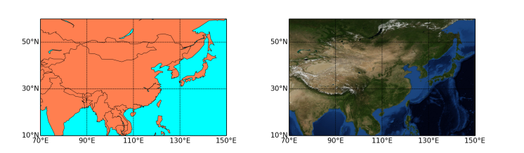

# 图片

## 1. 支持图片格式

模板支持的图片格式有：jpg，pdf，eps，png 等。

## 2. 插入图片方法

论文中图是很重要的，俗语曰：“一图胜千言，有图有真相”，总之，有图，言者能言之凿凿，观者能察之切切。


图就是插入到文档中的图片，下面展示一下操作的代码：

```latex
\begin{figure}[htbp!]
\centering
\includegraphics[width=0.6TeXtwidth]{figs/color/face.png}
\caption{南京信息工程大学本科生毕业论文 LaTeX 模板封面展示}
\label{nuist_face}
\end{figure}
```

## 3. 并列图及添加子图标题

大家在做论文时的时候经常需要两幅图并排的情况，还记得在 Word 用鼠标一点点的拖动吗，通常拖到最后两幅图安排得还是不尽如人意，就算搞定了一组，下一组又要拖呀拉呀的。当然稍稍高明一点可以借助 Word 的宏命令来控制，但 Word 中宏的学习曲线十分的陡峭，大家在网上找到的宏，自己想重新定制一下，也是比较困难的。下面来看看 LaTeX 是怎样精确控制并排图片占位大小的，从而使其各占一半水平空间。



其实现代码如下：

```latex
\begin{figure}[htbp!]
\centering
\includegraphics[width=0.5TeXtwidth]{figs/color/china1.png}\includegraphics[width=0.5TeXtwidth]{figs/color/china2.png}
\caption{中国地图展示（左图为素颜，右图为彩妆）}
\label{cn_map}
\end{figure}
```

是不是也想给左右两个子图各加一个标题？那其实也很简单，只要引入 `subfigure` 宏包就可以实现。

当然我们在引用的时候,可以引用母图，如 `\ref{subfig_cn_map}`，也可以引用子图，如 `\ref{subfig_cn_map}\subref{fig:sub1}`，`\ref{subfig_cn_map}\subref{fig:sub2}`。

好了让我们来看实现的代码吧：

```latex
\begin{figure}[htbp!]
\centering
\subfigure[素颜\label{fig:sub1}]{\includegraphics[width=0.5TeXtwidth]{china1.png}}
\subfigure[彩妆\label{fig:sub2}]{\includegraphics[width=0.5TeXtwidth]{china2.png}}
\caption{中国地图展示}
\label{subfig_cn_map}
\end{figure}
```

最后再给出一个例子，例如大家在做 EOF 分析时，可能要两个模态之间进行对比，我们知道每一个模态场都有一个时间序列与其对应，所以这样我们还可能用到 2×2 形式的图片排列方式，如图：

.png>)

我们可以用下面的命令来实现：

```latex
\begin{figure}[htbp]
\center
\subfigure[第一模态]{\label{eof_1}
\includegraphics[width=0.4TeXtwidth]{eof1.png}
}\subfigure[第二模态]{\label{eof_2}
\includegraphics[width=0.4TeXtwidth]{eof2.png}
}
\\
\subfigure[第一模态对应的时间系数]{\label{eof_t1}
\includegraphics[width=0.4TeXtwidth]{t1.png}
}\subfigure[第二模态对应的时间系数]{\label{eof_t2}
\includegraphics[width=0.4TeXtwidth]{t2.png}
}
\caption{ABLH 的 EOF 分析结果（第一第二模态及其时间系数）}\label{fig:eof_12}
\end{figure}
```

朋友们应该也发现奥秘所在了，对，就是那个双斜线 $\backslash\backslash$ 的作用，双斜线在 LaTeX 排版系统中就是换行的命令，知道了这一点，大家可以随意安排自己的图片了，可以用 $2\times 3$ 或者 $3\times 2$ 来摆放自己插图了。

## 4. 图片文件夹的指定

细心的朋友可能会发现所用的代码在指定图片路径时的写法不同，一种是相对路径，另一种是只有图片名称。这是为什么呢？原因很简单。为了在写作时引用图片方便，本文在导言区写上这样的 `\graphicspath{{figs/color/}}` 命令，来宏观地指定图片所存放的位置。

这一功能的好处就是，对于有的同学电子文档和打印文档所用图片色彩格式不同，这样只要一条命令就可以切换到另一个文件夹了，比较实用。
